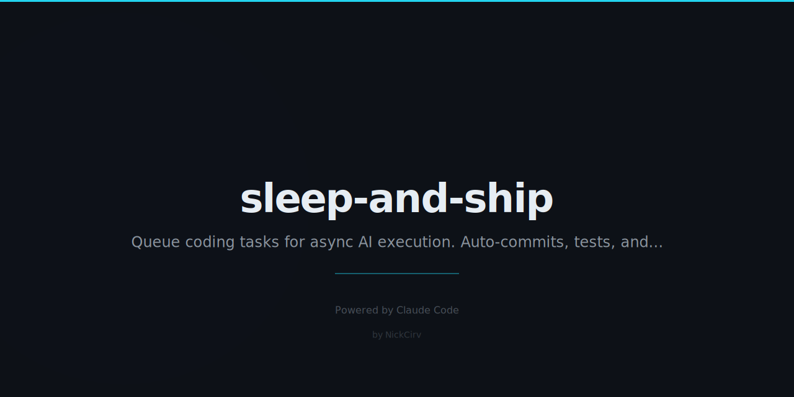

# sleep-and-ship

> Queue tasks at night. Wake up to deployed features.

Every developer's dream: go to bed, and your code writes itself.

## Quick Start

```bash
# Add tasks before bed
npx sleep-and-ship add "Add dark mode to the dashboard" --repo ./my-project
npx sleep-and-ship add "Fix the pagination bug on /users" --repo ./my-project
npx sleep-and-ship add "Add CSV export to the reports page" --repo ./my-project

# See your queue
npx sleep-and-ship list

# Install the overnight cron (runs at 2 AM)
npx sleep-and-ship install-cron

# Or run manually
npx sleep-and-ship run

# Check results in the morning
npx sleep-and-ship report
```

## How It Works

1. Queue tasks with natural language descriptions
2. At 2 AM, Claude Code processes each task on a separate branch
3. Tests run automatically — passing tasks get committed
4. Wake up to a morning report of what shipped

## The Morning Report

```
╭──────────────────────────────────────────────╮
│         SLEEP & SHIP — Morning Report        │
├──────────────────────────────────────────────┤
│  Ran at:       2/27/2026, 2:01:03 AM         │
│  Tasks ran:    5                             │
│  Completed:    4 ✓                           │
│  Failed:       1 ✗                           │
├──────────────────────────────────────────────┤
│  ✓ Add dark mode to the dashboard            │
│    → sleep-and-ship/task-1740614400000       │
│  ✓ Fix the pagination bug on /users          │
│    → sleep-and-ship/task-1740614401000       │
│  ✓ Add CSV export to the reports page        │
│    → sleep-and-ship/task-1740614402000       │
│  ✓ Update API docs                           │
│    → sleep-and-ship/task-1740614403000       │
│  ✗ Implement WebSocket notifications         │
│    → Error: Missing ws dependency            │
╰──────────────────────────────────────────────╯
```

## Safety

- Every task runs on its own branch — never touches `main`
- Tests must pass before committing (npm test or pytest)
- Failed tasks are logged with error details and the branch is cleaned up
- You review and merge — nothing ships without you

## Commands

| Command | Description |
|---|---|
| `add <task> --repo <path>` | Queue a task for tonight |
| `list` | Show pending tasks |
| `list --all` | Show all tasks including completed |
| `run` | Execute the queue (called by cron) |
| `report` | Show last night's results |
| `install-cron` | Add the 2 AM crontab entry |

## Requirements

- Node.js 18+
- Claude Code CLI installed (`npm install -g @anthropic-ai/claude-code`)
- `ANTHROPIC_API_KEY` environment variable set
- Git initialized in target repos

## Queue Storage

Tasks are stored at `~/.sleep-and-ship/queue.json`. Logs go to `~/.sleep-and-ship/log.txt`.

## Related

- [fix-it-felix](https://github.com/NickCirv/fix-it-felix) — Self-healing CI
- [one-prompt-saas](https://github.com/NickCirv/one-prompt-saas) — Full app from one prompt

## License

MIT — NickCirv
