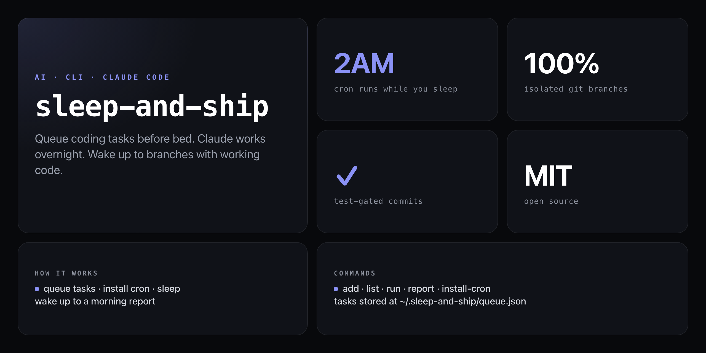

<div align="center">

**Queue natural-language tasks before bed. Claude Code runs them at 2 AM. Wake up to committed branches.**


</div>

---

You queue tasks in plain English before bed. A cron job fires at 2 AM, hands each task to Claude Code on its own isolated branch, runs your test suite, and commits only if tests pass. In the morning, `sleep-and-ship report` shows you what shipped and what failed — you review, merge, and move on.

```
╭──────────────────────────────────────────────╮
│         SLEEP & SHIP — Morning Report        │
├──────────────────────────────────────────────┤
│  Ran at:       2/27/2026, 2:01:03 AM         │
│  Tasks ran:    5                             │
│  Completed:    4 ✓                           │
│  Failed:       1 ✗                           │
├──────────────────────────────────────────────┤
│  ✓ Add dark mode to the dashboard            │
│    → sleep-and-ship/task-1740614400000       │
│  ✓ Fix the pagination bug on /users          │
│    → sleep-and-ship/task-1740614401000       │
│  ✓ Add CSV export to the reports page        │
│    → sleep-and-ship/task-1740614402000       │
│  ✓ Update API docs                           │
│    → sleep-and-ship/task-1740614403000       │
│  ✗ Implement WebSocket notifications         │
│    → Error: Missing ws dependency            │
╰──────────────────────────────────────────────╯
```

## Requirements

- Node.js 18+
- Claude Code CLI: `npm install -g @anthropic-ai/claude-code`
- `ANTHROPIC_API_KEY` environment variable set
- Git initialised in target repos

## Install

No npm account needed — run straight from GitHub:

```bash
npx github:NickCirv/sleep-and-ship
```

## Usage

```bash
export ANTHROPIC_API_KEY=your-key-here

# Queue tasks before bed
npx github:NickCirv/sleep-and-ship add "Add dark mode to the dashboard" --repo ./my-project
npx github:NickCirv/sleep-and-ship add "Fix the pagination bug on /users" --repo ./my-project
npx github:NickCirv/sleep-and-ship add "Add CSV export to the reports page" --repo ./my-project

# Install the 2 AM cron job
npx github:NickCirv/sleep-and-ship install-cron

# Check the queue before you sleep
npx github:NickCirv/sleep-and-ship list

# Wake up and read the report
npx github:NickCirv/sleep-and-ship report
```

## Commands

| Command | Description |
|---------|-------------|
| `add <task> --repo <path>` | Queue a task for tonight (`--repo` defaults to cwd) |
| `list` | Show pending tasks |
| `list --all` | Show all tasks including completed and failed |
| `run` | Execute the queue manually (also called by cron) |
| `report` | Show last night's results |
| `install-cron` | Add the `0 2 * * *` crontab entry |

Tasks are stored at `~/.sleep-and-ship/queue.json`. Logs at `~/.sleep-and-ship/log.txt`.

## How it works

1. `add` writes tasks to `~/.sleep-and-ship/queue.json` with status `pending`
2. At 2 AM, the cron entry fires `sleep-and-ship run`
3. Claude Code processes each task on a dedicated branch (`sleep-and-ship/task-<timestamp>`)
4. After Claude finishes, `npm test` or `pytest` runs — the commit only lands if tests pass
5. Status is written back to the queue file; `report` reads it in the morning

`main` is never touched. You review branches and merge what you want to keep.

## What it is NOT

- **Not autonomous deployment.** Nothing pushes or merges without you — branches are created locally and you decide what ships.
- **Not a task manager.** It queues coding tasks for Claude Code, not notes or reminders. Each task needs a target git repo.
- **Not guaranteed to succeed.** Claude Code may fail on ambiguous tasks, missing context, or missing dependencies — `report` tells you exactly what happened.

---

<div align="center">
<sub>Node 18+ · MIT · by <a href="https://github.com/NickCirv">NickCirv</a></sub>
</div>
