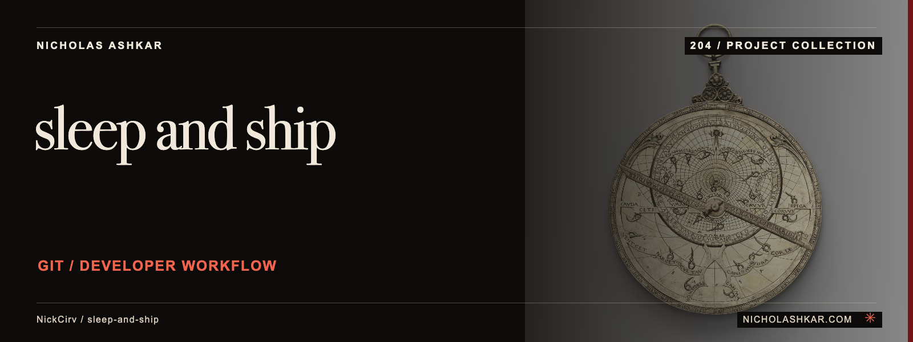

# sleep-and-ship

Queue coding tasks for a local Claude Code runner and inspect their recorded results.

Stores task state under `~/.sleep-and-ship`, creates task branches, invokes a coding assistant and attempts detected tests before committing changes.


<a id="install"></a>

## Quickstart

Package runtime requirement: Node.js `>=20`. Git is needed to obtain this pinned source checkout.

```bash
git clone https://github.com/NickCirv/sleep-and-ship.git
cd sleep-and-ship
git checkout 79bf0d4ab5ef572b283e6b82168b360729df2c98
npm install --ignore-scripts
node bin/sas.js --help
```

This source-derived example has not been executed in this review. Help describes queue commands without running a coding task or installing a schedule.


<a id="requirements"></a>

<a id="commands"></a>

<a id="how-it-works"></a>

## Usage

```bash
node bin/sas.js list --all
node bin/sas.js report
node bin/sas.js add "Add a focused unit test" --repo /path/to/disposable-repo
```

`add` writes the queue. `run` processes pending tasks. `install-cron` writes a daily 2 AM crontab entry. Inspect queue contents before any execution.

[Command reference](docs/REFERENCE.md) covers arguments, modes and output controls.


<a id="what-it-is-not"></a>

## Behavior and limits

The runner invokes Claude with `--dangerously-skip-permissions` and inherits the environment. It mutates the supplied checkout, stages all changes and commits with `--no-verify`; there is no clean-worktree preflight or isolated worktree. No detected test suite is treated as success. Failures may leave edits behind, and successive tasks can build on the current task branch. The implementation does not deploy features or publish PRs. Restrict experiments to disposable, credential-free repositories until these execution gaps are addressed.

## Development

Declared package scripts:

| Script | Command |
| --- | --- |
| `start` | `node bin/sas.js` |
| `test` | `node --test` |

The smoke test syntax-checks the entrypoint; it does not exercise CLI behavior or integrations.

## Research

[Source review and claim ledger](docs/RESEARCH.md) records revision `79bf0d4ab5ef`, inspected files and verification gaps.

## License and attribution

Protected license and attribution files remain unchanged: [LICENSE](https://github.com/NickCirv/sleep-and-ship/blob/79bf0d4ab5ef572b283e6b82168b360729df2c98/LICENSE).

[Artwork credits](assets/nicholas-ashkar/CREDITS.md) · [Nicholas Ashkar — consulting](https://nicholashkar.com/#oxblood-contact)
